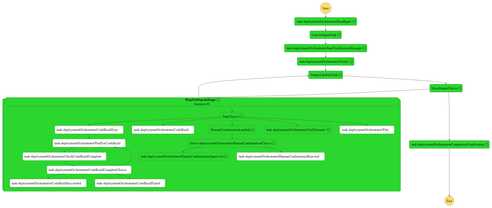

# Steppy the Deployment Orchestrator

Production releases involve lots of moving parts and many locations for human error to slip in. A person could trigger CI building the wrong branches, tags, commits; trigger builds to the wrong location or in the wrong order.

Steppy the Deployment Orchestrator aims to help coordinate in a more predictable and testable manner the steps of a release, working best in a multi-account AWS environment utilizing AWS CodeBuild and CodePipeline for deployments (although also supports Lambda and is easily extended).

This application is written using Infrastructure as Code (IaC) using the AWS Cloud Development Kit (AWS CDK). It uses the following AWS resources:

- IAM
- Step Function
- Lambda
- CodeBuild
- CodePipeline
- SNS
- API Gateway
- S3

A Steppy deployment is broken into stages, and stages are comprised of steps. Each stage is performed one after the other while all the steps in a stage are initiated simultaneously. Each stage waits for all steps to complete before moving to the next step, and any steps failing within a stage will halt the execution.

### Step Types

#### Human Step

This step is for anything in your deployment that involves manual checks before continuing, or any manual deployments. This step will create a task token and wait until that token is sent back to it either accepting or rejecting that step. Rejection will abort the entire deployment, acceptance will continue it. The wait period can be anywhere up to 365 days based on the longest execution time of a Standard Step Function execution.

This step uses an API for confirmation. The template can be extended to use other patterns, the current approach uses AWS SNS. Upon entry to the step a message is posted to an SNS topic with a link to confirm or reject. That SNS topic can be easily configured to send emails (as in the example below), post messages to Slack or MS Teams, add comments to GitHub or GitLab, or pretty much anything you can think of provided there's a mechanism for a user to get the confirmation link. The confirmation link contains a task token unique to this execution of the step function and a "reject" or "accept" value. The second stack in this project creates a simple API Gateway endpoint connected to a Lambda function, then the APIGateway endpoint recieves the GET request with the task token and accept/reject message it will confirm the Step Function's step allowing it to continue.

#### CodeBuild / CodeBuild No Wait

Executes a CodeBuild project. It optionally provides a branch or tag for the CodeBuild to be executed against, as well as optional environment value overrides for the CodeBuild's execution.

There are two types of CodeBuild step types, sync and async. The sync CodeBuild is currently using the CallAwsService task type that unfortunately currently doesn't support sync checking of the task started. The StartCodeBuild task type does support sync executions but adds complexity to dynamic CodeBuild names so this project adds a little complexity to make the CallAwsService (AWS SDK) task syncronous. After initiating the CodeBuild a loop is entered, every 30 seconds the status of the CodeBuild execution (using the ID of the build that was started) is checked. If it moves to either Success or Failure the step completes, otherwise it waits another 30 seconds and continues the loop. Most CodeBuilds are configured to fail after 60 minutes, but this step supports waiting up to 365 days for a CodeBuild to complete.

The async CodeBuild step simply starts the CodeBuild and moves on.

#### CodePipeline

Executes a CodePipeline waiting for it to complete (optionally approving any approval stages).
This step type is currently in progress, it's expected to mirror the CodeBuild step type very similarly in terms of parameters and sync/async types.

#### Wait

A wait of any number of seconds passed as a parameter, up to 365 days.

#### Notify

This step will publish an SNS message with any string to a topic, used to send notifications to Slack or MS Teams, email users, send text messages, etc. This can be used to send status reports in between stages, to send notifications before stages that include downtime, or just a "everything is complete" message.

## Deployment of Steppy

Steppy is comprised of two stacks, both of which need to be deployed to the same AWS account. A typical well architected pattern is to have an Operations account that deploys to workload accounts, Steppy needs to be deployed to that Operations account in order to access the infrastructure responsible for deployments.

Steppy's first stack is responsible for the human confirmation step type:

```MarkDown
        User
        |
        | GET request
        V
+-------------------+   +----------------+
|                   |   |                |
| API Gateway       +-->| AWS Lambda     |
| (APIGW)           |   |                |
|                   |   |                |
+-------------------+   +-------+--------+
                                |
                                | Confirm
                                | callback
                                V
                        +---------------+
                        |               |
                        | AWS Step      |
                        | Function      |
                        |               |
                        +-------+-------+
```

Steppy's second stack is responsible for the actual deployments. It's primarily a Step Function, supported by several TypeScript Lambda functions. The stack creates the required roles in IAM and provisions everything from the same stack.

Example stacks:

```JavaScript
new DeploymentOrchestrator(app, "DeploymentorchestratorStackSBX", {
  // Prefix used in any infrastructure deployed, "Steppy" wasn't hardcoded so no one has meetings involving describing "Steppy".
  applicationName: "steppy",
  // ARNs of any CodeBuilds that Steppy might need to execute.  It's granted permission to run them and list execution details.
  codeBuildArns: ["arn:aws:codebuild:ca-central-1:<<account-number>>:project/codebuildTestingOrch"],
  // Human readable name of the environment, used in notification messages
  environmentName: "DEV",
  // A pre-existing topic for publishing SNS messages, configured however you'd like to pass messages (eg. email/text)
  snsNotificationTopicName: "NotificationTopic",
  // Name of this stage, used in the names of infrastructure deployed
  stageName: "sbx01",
  description: "Deployment Orchestrator",
});

new DeployOrchHumanStep(app, "DeployOrchHumanStepSBX", {
  // Used prefixing infrastructure, it must match the other stack.  You can create independent stacks of Steppy this way if you'd like!
  applicationName: "steppy",
  // The human confirmation step *currently* needs to know the ARN of the step function, in future this will be done differently
  parentStepFunctionArn:
    "arn:aws:states:ca-central-1:<<account-number>>:stateMachine:sfn-deploymentOrchestrator-sbx01-cac1-01",
  stageName: "sbx01",
});
```

## Usage of Steppy

The plan for Steppy is the introduction of a translation layer, to parse Excel sheets or other document types and convert them to a JSON object passed to the validator function. Currently Steppy works from an S3 bucket it provisions, checking for a JSON `input` file.

Example input file:

```JavaScript
{
  "stages": [
    {
      "name": "Stage 1 - Build some CodeBuilds",
      "steps": [
        {
          // This will trigger the sync CodeBuild step, waiting for the CodeBuild to complete before moving on
          "type": "CodeBuild",
          // Names can be assigned to the steps to aid in observability of the execution and notifications
          "name": "Step 1 - CodeBuild",
          // The name of the CodeBuild to be run
          "codeBuildName": "codebuildTestingOrch",
          // The source version, in this case the main branch
          "sourceVersion": "main"
        },
        {
          // This is a "human wait" step, that will wait for a confirmation using the Human Confirm APIGW endpoint
          "type": "Human",
          "name": "Step 2 - Ask a human to confirm",
          // This message will be included in the SNS publish, and in this example included in the email sent to the user
          "message": "Howdy there, please confirm"
        }
      ]
    },
    {
      // This stage has nothing in it that waits for completion, it will execute every step and immediately move to the next stage
      "name": "Stage 2 - Zoomy",
      "steps": [
        {
          // This CodeBuild execution step won't wait for the CodeBuild to complete.  It triggers and moves on.
          "type": "CodeBuildNoWait",
          "name": "step1",
          "codeBuildName": "codebuildTestingOrch",
          "sourceVersion": "main"
        },
        {
          // This step publishes an SNS message to users
          "type": "Notify",
          "name": "step2",
          "message": "Howdy there this is a notification from the orchestrator!"
        },
        {
          // This will begin a CodePipeline execution
          "type": "CodePipeline",
          "name": "step3",
          "codePipelineName": "testingOrchPipeline"
        }
      ]
    },
    {
      "name": "stage3",
      "steps": [
        {
          "name": "step2",
          "type": "Notify",
          "message": "The orchestrator is complete successfully!"
        }
      ]
    }
  ]
}

```

AWS Step Functions offer fantastic observability of the actual steps and data involved, below is an example of this input's execution:

<!-- Image below -->



## How Steppy Works

Steppy uses AWS Step Functions, a serverless orchestration service. Step Functions offer the ability to define workflows containing branching logic, loops, and maps. Individual "steps" within a Step Function or "State Machine" are called tasks. Tasks can pass data between each other, passing a single object around and adding, removing, transforming, or replacing data within it. For larger payloads between tasks files in S3 are used, as the data is fairly limited in size.

In this case the biggest two components are a "Map" task and a Lambda that increments the stages and provides a list of the steps in that stage.

The Map task is responsible for each stage and scales horizontally, creating a separate layer for each step in a stage to execute them simultaneously. The map contains a Choice step that routes each step to the correct handler, eg to the branch responsible for executing a CodeBuild.

The Lambda that handles deciding what the current stage is and what the steps are is called "Steppy" and the inspiration for this project's name. Steppy is a simple Lambda that uses the `iterator` object, incrementing each stage and adding the current steps to a list to be passed to the Map task.

## Extending with additional deployment types

This project currently includes a work-in-progress Lambda to be used to extend step types. Registering a step validator to confirm the JSON object initiating the project as well as an executor function to take that particular step in the execution. the goal is to leverage AWS Lambda to write any kind of deployment step, from triggering Jenkins to GitLab CI or triggering 3rd party test suites.

## Roadmap

Next steps for this project:

- Add a transformation layer for popular input files like Excel
- Update the human validation stack to a nested stack within the primary stack, preventing cyclical dependencies between the two
- Add a validator step to confirm the JSON object provided contains required params
- Step types, adding more step types to cover common AWS practices such as backing up databases or running ETL pipelines
- Extensions through registering plugins in the extension Lambda to add additional step types
- Dashboarding, giving the execution of the step function a web-based UI to track and control the progression of a deployment
